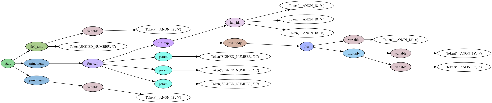

# 🧑‍💻 Mini Lisp Interpreter
**Final Project for the Course: `Compiler`.**

## 🔖 Abstract
This project is a Mini-Lisp interpreter designed to handle the following features:

### Basic Features:
|    | Feature                | Description                                           | Points |
|----|------------------------|-------------------------------------------------------|--------|
| ✅ | Syntax Validation      | Prints "syntax error" when parsing invalid syntax     | 10     |
| ✅ | Print                  | Implements `print-num` statement                      | 10     |
| ✅ | Numerical Operations   | Implements all numerical operations                   | 25     |
| ✅ | Logical Operations     | Implements all logical operations                     | 25     |
| ✅ | if Expression          | Implements `if` expression                            | 8      |
| ✅ | Variable Definition    | Allows defining a variable                            | 8      |
| ✅ | Function               | Allows declaring and calling an anonymous function    | 8      |
| ✅ | Named Function         | Allows declaring and calling a named function         | 6      |

### Bonus Features:
|    | Feature                | Description                                           | Points |
|----|------------------------|-------------------------------------------------------|--------|
| ✅ | Recursion              | Supports recursive function calls                     | 5      |
| ✅ | Type Checking          | Prints error messages for type errors                 | 5      |
| ❌ | Nested Function        | Supports nested functions (static scope)              | 5      |
| ❌ | First-class Function   | Supports passing functions and closures               | 5      |

## 🚀 Getting Started

### Prerequisites
- Python >= 3.9

### Environment Setup
1. Clone this repository:
    ```bash
    git clone https://github.com/wangwenho/mini-lisp-interpreter.git
    ```
2. Create a conda environment:
    ```bash
    conda create -n mini-lisp python==3.9.20
    conda activate mini-lisp
    ```
3. Install required packages:
    ```bash
    conda install lark pydot ipykernel
    ```

## 📖 How to Use
- You can run `mini_lisp_interpreter.ipynb` to check the results and see the AST graph.
- The AST graph will be saved in the `assets` folder.

## ☕️ Some Test Cases
- `public_test_data/01_2.lsp`
    ```lisp
    (+ (* 5 2) -)
    ```
    Output:
    ```
    Syntax Error
    ```

- `public_test_data/02_2.lsp`
    ```lisp
    (print-num 0)
    (print-num -123)
    (print-num 456)
    ```
    Output:
    ```
    0
    -123
    456
    ```
    

- `public_test_data/03_2.lsp`
    ```lisp
    (print-num (mod 10 (+ 1 2)))

    (print-num (* (/ 1 2) 4))

    (print-num (- (+ 1 2 3 (- 4 5) 6 (/ 7 8) (mod 9 10))
                11))
    ```
    Output:
    ```
    1
    0
    9
    ```
    

- `public_test_data/04_2.lsp`
    ```lisp
    (print-bool (or #t #t #f))
    (print-bool (or #f (and #f #t) (not #f)))
    (print-bool (and #t (not #f) (or #f #t) (and #t (not #t))))
    ```
    Output:
    ```
    #t
    #t
    #f
    ```
    

- `public_test_data/05_2.lsp`
    ```lisp
    (print-num (if (< 1 2) (+ 1 2 3) (* 1 2 3 4 5)))

    (print-num (if (= 9 (* 2 5))
                0
                (if #t 1 2)))
    ```
    Output:
    ```
    6
    1
    ```
    

- `public_test_data/06_2.lsp`
    ```lisp
    (define a (* 1 2 3 4))

    (define b (+ 10 -5 -2 -1))

    (print-num (+ a b))
    ```
    Output:
    ```
    26
    ```
    

- `public_test_data/07_2.lsp`
    ```lisp
    (define x 0)

    (print-num
    ((fun (x y z) (+ x (* y z))) 10 20 30))


    (print-num x)
    ```
    Output:
    ```
    610
    0
    ```
    

- `public_test_data/08_2.lsp`
    ```lisp
    (define bar (fun (x) (+ x 1)))

    (define bar-z (fun () 2))

    (print-num (bar (bar-z)))
    ```
    Output:
    ```
    3
    ```
    

- `public_test_data/b1_2.lsp`
    ```lisp
    (define min
    (fun (a b)
        (if (< a b) a b)))

    (define max
    (fun (a b)
        (if (> a b) a b)))

    (define gcd
    (fun (a b)
        (if (= 0 (mod (max a b) (min a b)))
            (min a b)
            (gcd (min a b) (mod (max a b) (min a b))))))

    (print-num (gcd 100 88))

    (print-num (gcd 1234 5678))

    (print-num (gcd 81 54))
    ```
    Output:
    ```
    4
    2
    27
    ```
    

- `public_test_data/b2_2.lsp`
    ```lisp
    (define f
    (fun (x)
        (if (> x 10) 10 (= x 5))))

    (print-num (* 2 (f 4)))
    ```
    Output:
    ```
    Type Error
    ```
